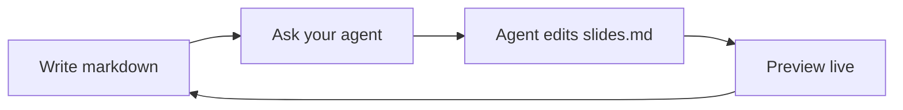

# Slidev AI Template

A minimal starter for building slides with AI agents

<div class="pt-12">
  <span class="opacity-70">Press <kbd>space</kbd> to continue</span>
</div>

---
layout: default
---

# Just Write Markdown

Each `---` starts a new slide. This whole deck is one `slides.md` file.

- Bullet points, headings, and inline `code` work as usual
- Split layouts, images, and two-column slides are built in
- Ask your AI agent to add, reorder, or rewrite slides for you

---
layout: two-cols
---

# Code Highlighting

Fenced code blocks are syntax-highlighted out of the box.

```ts {2|3|all}
function greet(name: string) {
  const message = `Hello, ${name}!`
  return message
}
```

::right::

# Click Animations

Use `v-click` to reveal content one step at a time.

<v-clicks>

- First point
- Second point
- Third point

</v-clicks>

---

# Diagrams

Mermaid diagrams render directly in markdown.



---
layout: center
class: text-center
---

# Your Turn

Replace these slides with your own content, or ask your AI agent to do it.

See `CLAUDE.md` for how the agent tooling in this template works.
