# Work anywhere with   Claude Code in the Cloud

What, when, and why to use Claude Code's cloud environment

---
layout: image-left
image: ./images/narze.jpg
class: text-left
---

# Manassarn Manoonchai

Noom `@narze`

- `Eventpop` - Lead Software Engineer
- `TokenMe` - CTO / Co-founder
- `Manoonchai` - Keyboard Layout
- `GeekCraft` - Maker

---
layout: default
---

# Quick survey

Raise your hand 🙋

- Who's using Claude Code?

<v-clicks>

- \+ Claude mobile app?
- \+ Claude Remote? (`/rc`)
- \+ Claude Code on the web?
- \+ Claude Routine?

</v-clicks>

---
layout: center
---

# Claude Code on multiple platforms

---
layout: default
---

# Claude Code on local machine

- CLI
- Text Editor, IDE (via extensions)
- Desktop App

---
layout: default
---

# Claude Code remote

- Also local, but control via mobile app i.e. "Remote control"
- Setting: `Enable Remote Control for all sessions`

---
layout: default
---

# Claude Code on the web

- Runs on Anthropic-managed cloud server
- GitHub Repo Integration
- I'll call it "Claude Cloud"

---

# What's in the Cloud?

- Ubuntu 24.04
- 4vCPU, 16GB RAM, 30GB disk
- Preinstalled: Node.js, Python, Ruby, PHP, Java, Rust, Go, Docker, Postgres, Redis, `git`, `jq`, etc.

---
layout: center
---

# Claude Remote vs Claude Cloud

What's the difference?

---
layout: two-cols-header
---

::left::

Claude Remote

::right::

Claude Cloud

::center::

---
layout: default
---

# How to use Claude Cloud

- Desktop app
- Mobile app
- Web
- CLI

---

# Claude Cloud - Desktop

- Click `Local`, then change to `Cloud`, and add cloud environment

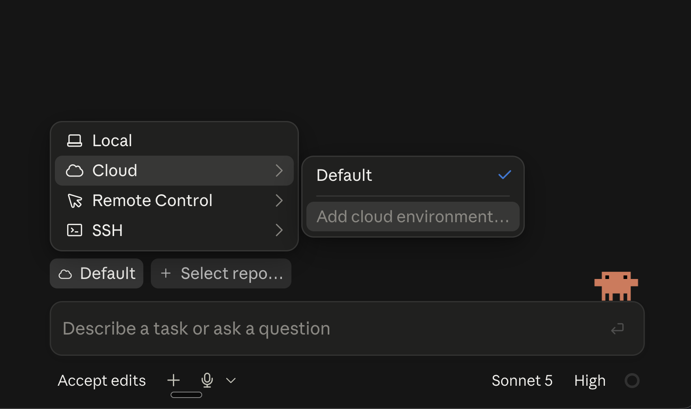

---

# Claude Cloud - Desktop

- Setup cloud environment

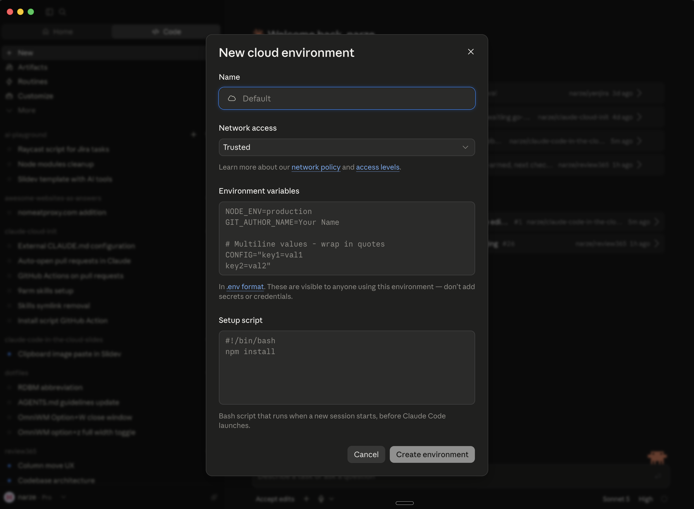

---

# Claude Cloud - Desktop

- Select repo(s) to use

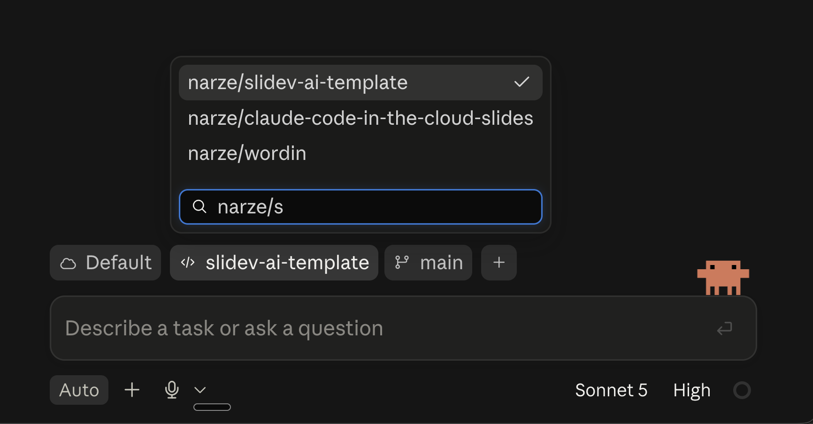

---

# Claude Cloud - Web

Same as desktop, but runs on browser - `claude.ai/code`

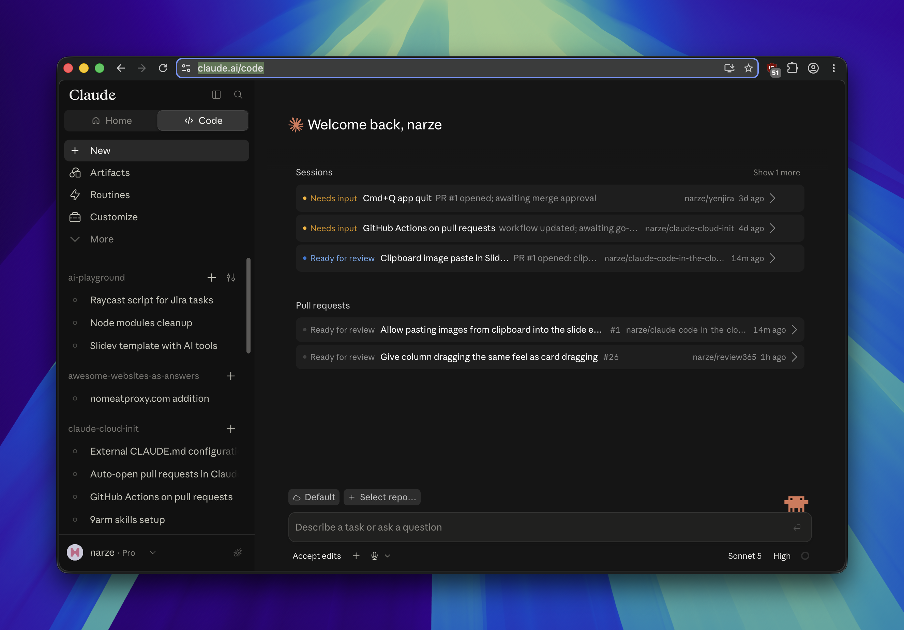

---

# Claude Cloud - Mobile

  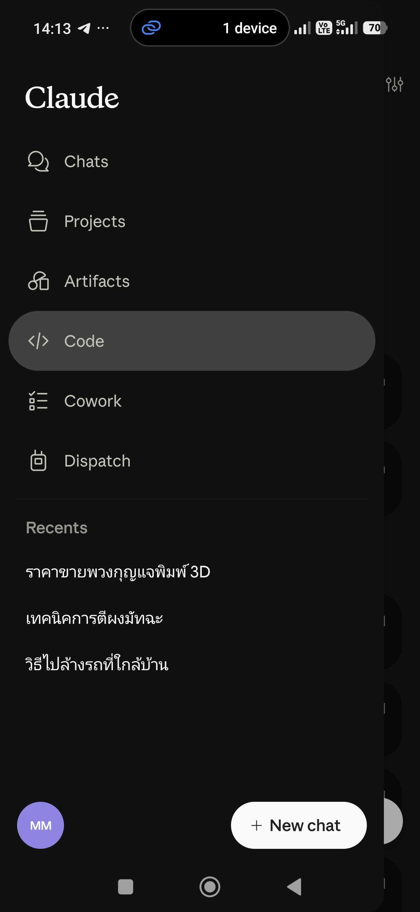
  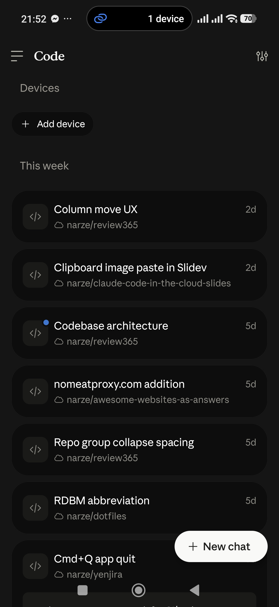
  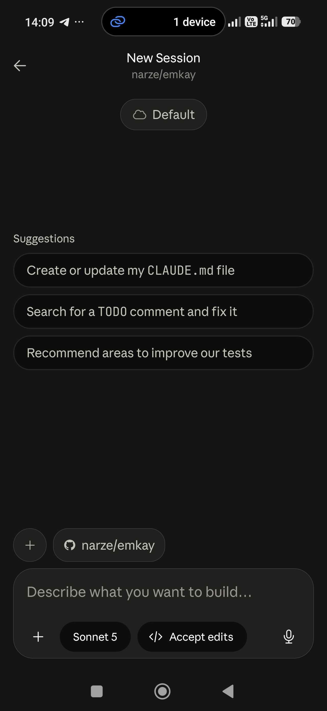

---

# Claude Cloud - CLI

- `claude --cloud "Prompt"`
- Continue on app/web or CLI with `--teleport`
- Weird workflow, not recommended

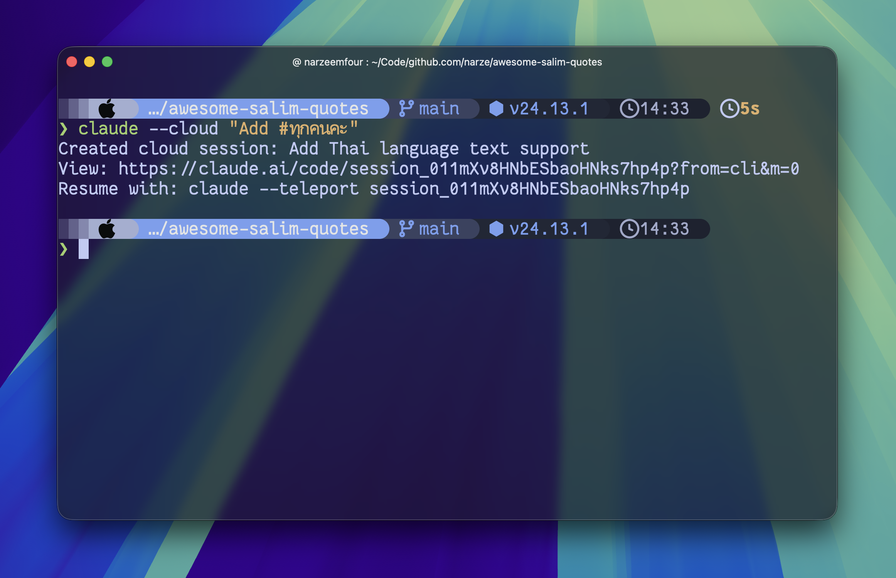

---
layout: center
class: text-center
---

# Use cases & examples

---

# Plan on mobile -> Continue on laptop

Plan & work on commute, continue and review at work/home

  

    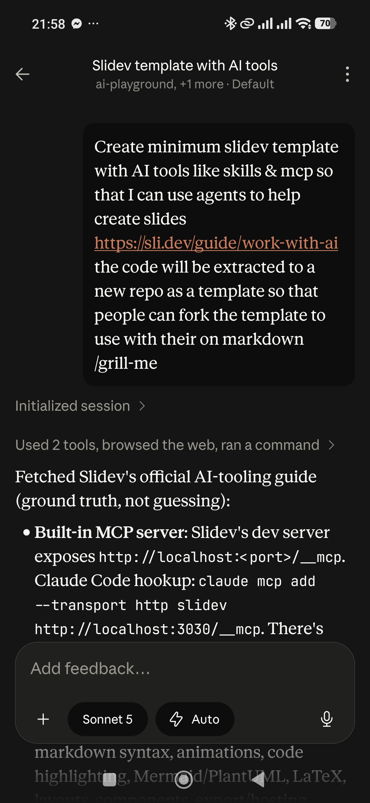
    
Plan & work

  

  

    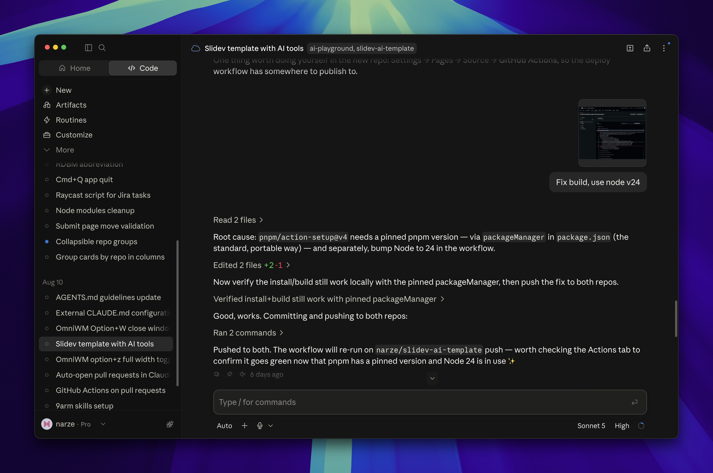
    
Review & fix

  

---
layout: default
---

# Use with connectors / skills

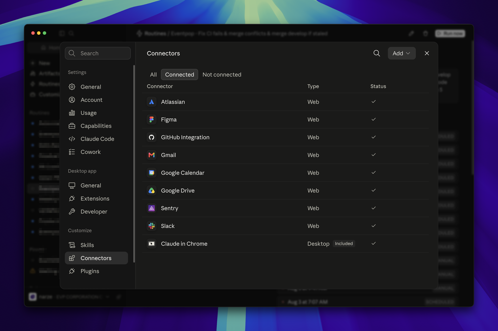

---

# Example prompts

- `"Implement jira task EVP-1234"`
- `"Babysit github PR #5678"`
- `"Fix bug reported from Slack <link-to-slack-thread>"`
- `"/grill-me Improve UI/UX on this page <paste-image>"`
- `Would you kindly rewrite everything in Rust? No mistakes. 🦀`

---
layout: default
---

# Use with Claude Routine

- Claude Routine could also use cloud environment

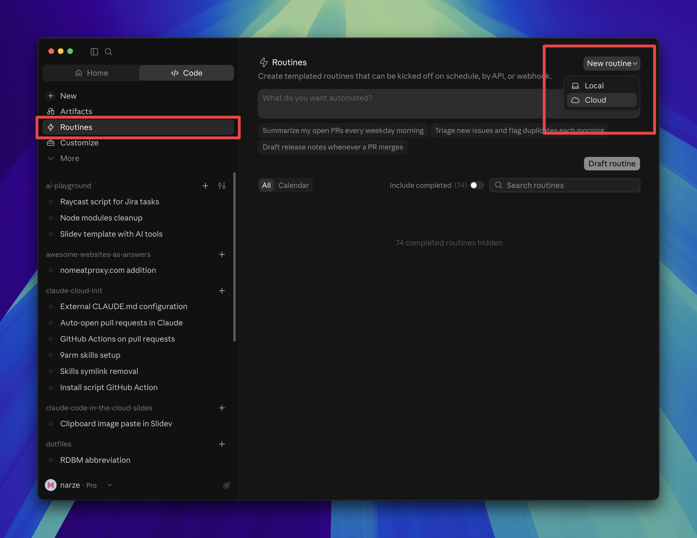

---

# Claude Routine + Cloud
Automated PR from schedule & event trigger

- Daily - Fix my PR merge conflicts
- Daily - Scan unresolved issues on Sentry, choose one and fix it
- Github event - When PR merged, post changes summary in non-technical term to Slack
- Weekly - Update project's agent skill with `npx skills update -p`
- Custom `POST` webhook trigger

---
layout: default
---

# Routine + Cloud: Fix CI fails & merge conflicts

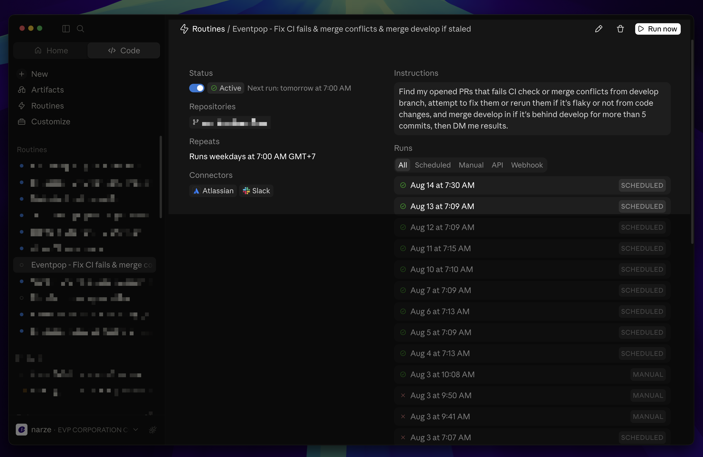

---
layout: default
---

# Routine + Cloud: Automated pull requests

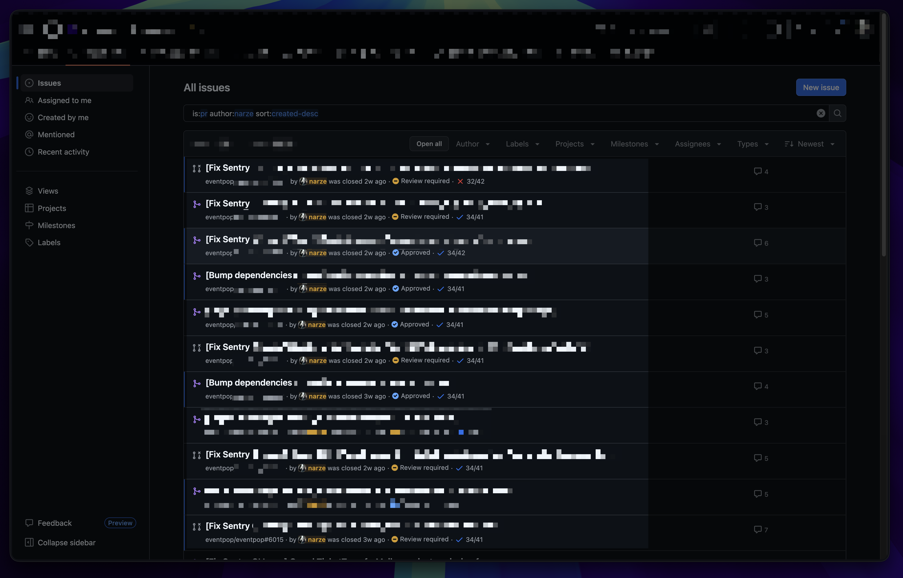

---
layout: center
---

# Summary

---

# Claude Cloud - The Good

<v-clicks>

- Works from anywhere, any device
- Minimum setup
- Auth connectors once, use anywhere
- Anthropic-cloud is FREE (For now)
- Sandboxed environment by default (code cloned from Github, your data is safe)
- No need to manage local resources, RAM is saved
- Parallel with no overhead (Bottleneck is you & your code reviewers)

</v-clicks>

---

# Claude Cloud - The Not So Good

<v-clicks>

- Github integration only
- Repo setup : If your codebase needs complicated setup locally, it will be hard on the cloud, too.
  - Outcome 1 : Project cannot run and agent edit code blindly, hence worse result
  - Outcome 2 : Project cannot run and agent tries to make it run, hence more token consumption, less context for work
- Your local Claude skills, plugins may not work
- Cold-starts & cold-resume
- Harder to debug mid-session (no debugger, no shells, no logs, only prompt)

</v-clicks>

---
layout: center
---

# Tips & Tricks

---

# Inject skills & CLAUDE.md with `narze/claude-cloud-init`

- Problem: I want to use my own set of agent skills & CLAUDE.md
- Solution: Create custom bash script to download & inject files into cloud environment

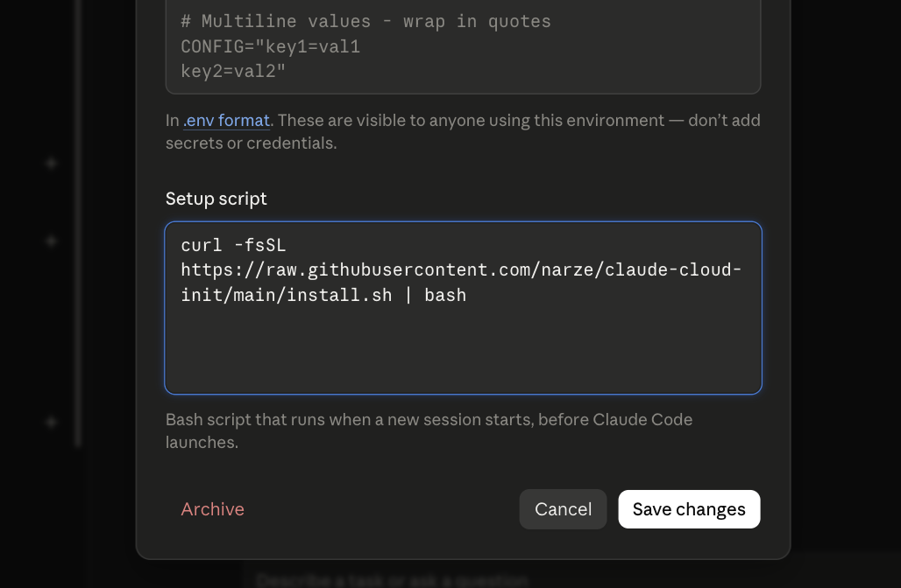

---

  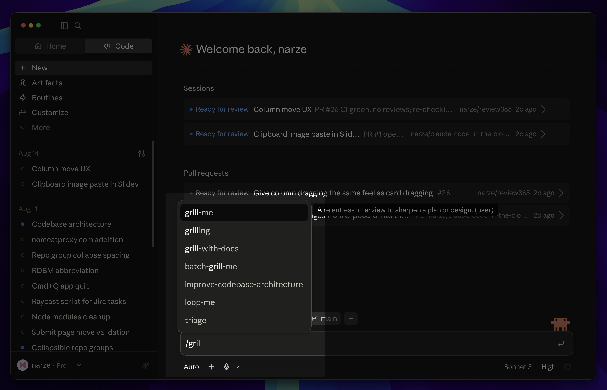 
  Use Matt's skills anywhere!

---

# Setup cloud environment for complex projects

- Prompt: `"Setup the project so that app and tests can be run, then create single bash script to replicate the successful setup."`
- When it succeeds, paste the script in setup step and test in fresh session to verify that it works

---
layout: center
class: text-center
---

# Your Turn

Open Claude on the web right now and try it out!
